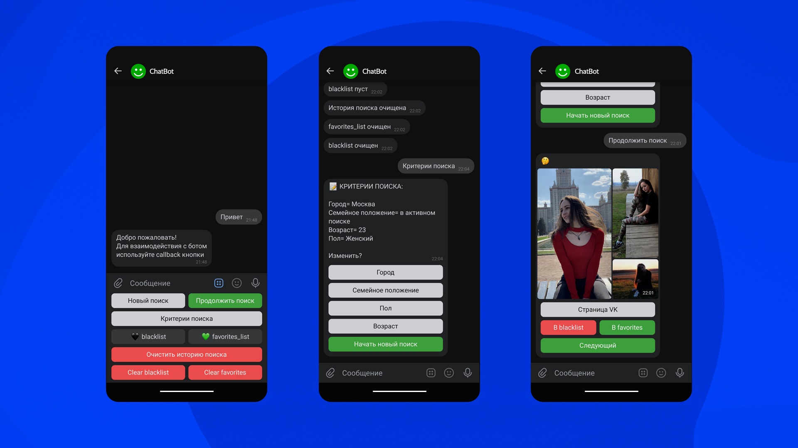

# VK-bot 

## Функции 
Используя  полученные данные от пользователя VK, бот ищет  подходящих людей под условия поиска.
#### Реализованные критерии поиска:
* возраст
* пол
* город
* семейное положение
#### Результат поиска:
* Топ-3 фотографии каждого человека, подошедшего под запрос пользователя, с ссылкой на страницу VK (популярность определяется количеством лайков и комментариев).
* Взаимодействие c ботом  реализовано с помощью VK Callback кнопок.
* Результат программы записывается в БД.
* Люди не повторяются  при повторном поиске.
* Есть возможность  сохранить ответ в черный/избранный список.



### Настройки
Как настроить группу и получить токен можно найти в [инструкции]()
#### Входные данные: 
```python
app_id = "ID приложения Вк"
group_id = "ID группы Вк"
token_group = "Токен группы Вк"
token_user = "токен пользователя Вк"
sqlalchemy_DB = 'Адрес базы данных'
```